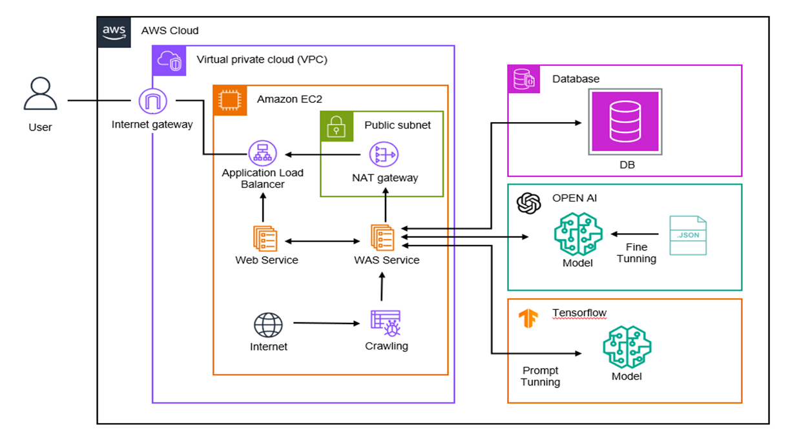

![header] 생성형AI를 활용한 자산운용보고서 자동생성

## 프로젝트 소개
**본 서비스(‘FAAI’)는 자산 운용 및 펀드에 관심을 가진 개인 사용자와 자산운용 보고서 작성이 필요한 자산운용사에게 도움을 주는 서비스로, 개인용과 기업용으로 기능을 두 파트로 분리**
- 개인용은 요약된 운용보고서 제공 및 채팅 기능을 제공하여 펀드 투자 결정을 도와준다.
- 기업용은 자산운용보고서의 운용 보고와 향후 계획 부분을 자동으로 작성해주는 기능으로 시간 및 비용적 효율을 높여준다.

## 주요 기능
- [기업] 자산운용보고서의 운용 보고 및 운용 계획 부분 작성 자동화
- [개인] 해외자산운용보고서 해석 및 요약 기능
- [개인] 자산운용보고서 속의 어려운 용어 및 이해를 돕는 채팅 기능
- [개인] 개인의 자산운용을 위한 실시간 인기 펀드 및 경제 소식 제공

## 아키텍처

## 사용 툴
- Chat GPT 3.5 API
- Spring Boot Framework
- React
- AWS EC2 Server
